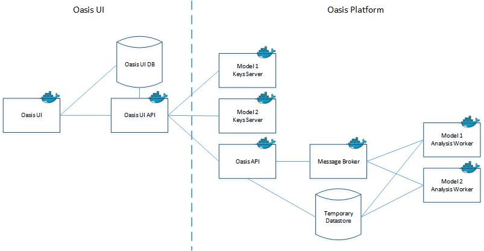

## Oasis Platform

### Oasis UI

TODO

### Oasis Platform Architecture

| **Component** |	**Description** | **Technology** |
| Oasis UI	| Browser based application for managing exposure data and operating modelling workflows |	R Shiny, ShinyProxy |
|Oasis | UI API	Services for interacting with exposure and output data |	Flask |
|Oasis UI Database	| Storage for exposure data, workflow configurations and system data. | SQL Server | 
|Oasis API |	Services for uploading Oasis files, running analyses and retrieving outputs. |	Flask, Celery | 
|Message Queue |	Queues for managing workload across multiple calculation back ends. |	Rabbit MQ |
|Data store |	Storage for transient analysis data.	| File share |
|Keys Server |	Model specific services for generating area peril and vulnerability keys for a particular set of exposures.	| Flask, Python |
|Analysis Worker |	Executes a model. |	Celery, running as daemon, ktools, model data |

## Technologies

### Using

| Python 2.7 | General system programming and tools | 
| C++ 11 | Simulation and analytics kernel. |
| SQL Server 2016 | Application database for UI. |
| Docker | Deployment of Oasis Platform and UI. |
| Ubuntu 16.07 | Development servers and base Docker image. |
| AWS EC2 | Cloud infrastructure for Oasis Model Library and Oasis Pltaform deployment. |
| Jenkins 2 with BlueOcean | CI system. |
| Flask | Web service framework. | 
| Apache | Web server. |
| Terraform | Infrastructure automation. |
| Sphinx | Code documentation generation. |
| RShiny | Application framework build on R. |
| ShinyProxy | Server for scaling RShiny applications. |

### Adopting

| Python 3 | General system programming and tools. |
| RedHat | Development servers and base Docker image. |
| Azure | Oasis Platform deployment. |
| MySql | Application database for UI. |

### Trialing

| Kubernetes | Managing Oasis Platform compute cluster. |
| Nginx | Web server. |
| Jupyter | Python notebooks for running Oasis MDK. |