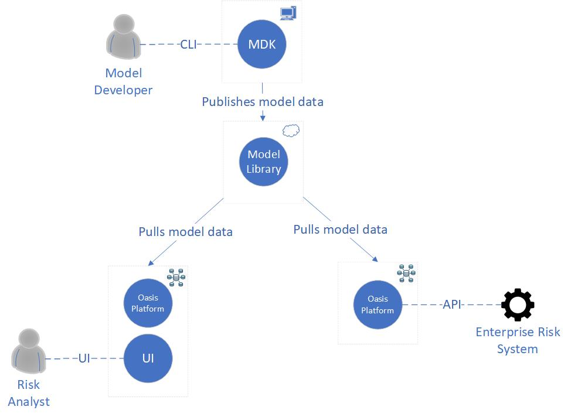

The Oasis Loss Modelling Framework is an open source catastrophe modelling platform, free to use by anyone. It is also a community that seeks to unlock and change the world around catastrophe modelling to better understand risk in insurance and beyond. While its development is largely driven by the global (re-)insurance community, it seeks to provide tools and utility to all. 

Our main users are:

**Model developers**, who build, test and publish the risk models. They are typically scientists or software developers working in a risk modelling company, or academics users.

**Risk analysts** who operate the models for decision support purposes. They core user group are analysts at insurance or reinsurance organizations, as well government and third sector users.

**Enterprise risk systems** at insurance or reinsurance organizations, where Oasis risk models will be integrated into pricing and portfolio management workflows.

Our software components are:

**Oasis Platform** is a catastrophe modelling system that encompasses a set of data standards, an API, tools and components for building and running models. This is the core part of Oasis underpinning the other components and is where most of the domain specific code and performance optimization is required. We will refer to a deployed version of the LMF, be that on a cluster, on an analysis server, in the cloud, as an Oasis.

**Oasis User Interface (UI)** is a web-based application for uploading exposure data, running models deployed in Oasis, and retrieving results data. It is targeted at operating models by (re)insurance companies in in conjunction with existing exposure management and reporting tools; model evaluation; and using models in government or third sector contexts.
 
**Oasis Model Development Kit (MDK)** is a set of tools for building, calibrating and creating a model, ready to be deployed into the Oasis Platform. It is designed with a model developer or academic user in mind, who are likely to be comfortable working directly with the data from the command line or programmatically.  

**Oasis Model Library** is a hosted catalogue for Oasis models, hosted in AWS. It allows regression of the models after updates to the Oasis Platform code, and validation of model operation and scalability within a hosted Oasis Platform.
