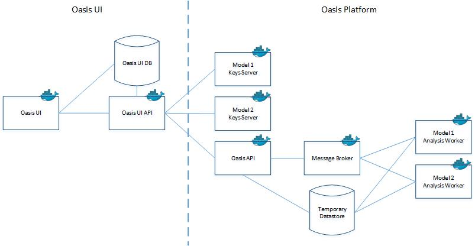

## Mission

Oasis Loss Modelling Framework is an open source catastrophe modelling platform, free to use by anyone. It is also a community that seeks to unlock and change the world around catastrophe modelling to better understand risk in insurance and beyond. While its development is largely driven by the global (re-)insurance community, it seeks to provide tools and utility to all.
- To learn about our organization and community, visit our [website](http://www.oasislmf.org)
- To learn about the role of catastrophe models in risk assessment and the Oasis Loss Modelling Framework is used, take our [MOOC](http://www.oasismooc.org/)
- To lean about our development plans, constructed and prioritised based on feedback from our community, visit our [backlog board](https://trello.com/b/7O0krVYr/backlog)

## Loss Modelling Framework

The Oasis Loss Modelling Framework supports a full eco-system that allows risk models to be built, published and operated in a standardized manner. The main users of the ecosystem are:

**Model developers**, who build, test and publish the risk models. They are typically scientists or software developers working in a risk modelling company, or academics users.

**Risk modellers** who operate the models for decision support purposes. They core user group are analysts at insurance or reinsurance organizations, as well government and third sector users.

**Enterprise risk systems** at insurance or reinsurance organizations, where Oasis risk models will be integrated into pricing and portfolio management workflows.

The main components of the ecosystem are:

**Oasis Platform** is a catastrophe modelling system that encompasses a set of data standards, an API, tools and components for building and running models. This is the core part of Oasis underpinning the other components and is where most of the domain specific code and performance optimization is required. We will refer to a deployed version of the LMF, be that on a cluster, on an analysis server, in the cloud, as an Oasis.

**Oasis User Interface (UI)** is a web-based application for uploading exposure data, running models deployed in Oasis, and retrieving results data. It is targeted at operating models by (re)insurance companies in in conjunction with existing exposure management and reporting tools; model evaluation; and using models in government or third sector contexts.
 
**Oasis Model Development Kit (MDK)** is a set of tools for building, calibrating and creating a model, ready to be deployed into the Oasis Platform. It is designed with a model developer or academic user in mind, who are likely to be comfortable working directly with the data from the command line or programmatically.  

**Oasis Model Library** is a hosted catalogue for Oasis models, hosted in AWS. It allows regression of the models after updates to the Oasis Platform code, and validation of model operation and scalability within a hosted Oasis Platform.

The components fit together into an ecosystem for  model building, publishing and operation as illustrated in the following diagram:

## Development Approach

1.We build open source software. This allows the community to directly review and critique our code and methodologies, and to contribute code for our review. 

2.We use open source technology. We look to build on standard, modern technologies that 
will reduce the operational cost and/or improve the operational performance of models, that 
have solid support options for enterprise use, and that are free for general use. 

3.We are building a full stack development team. Every team member should understand the 
system and technologies, be able to build and test the system and have a working knowledge 
of catastrophe modelling. 

4.We use the community to drive development. We have direct access to many of the leading 
practitioners in the catastrophe modelling domain, and we get practical input through feature 
prioritization, specification and review of working software. 

5.We use partnerships to provide scale, for hosting, support and non-core development. 

## Oasis Platform

### Oasis UI

TODO

### Oasis Platform Architecture

| **Component** |	**Description** | **Technology** |
| Oasis UI	| Browser based application for managing exposure data and operating modelling workflows |	R Shiny, ShinyProxy |
|Oasis | UI API	Services for interacting with exposure and output data |	Flask |
|Oasis UI Database	| Storage for exposure data, workflow configurations and system data. | SQL Server | 
|Oasis API |	Services for uploading Oasis files, running analyses and retrieving outputs. |	Flask, Celery | 
|Message Queue |	Queues for managing workload across multiple calculation back ends. |	Rabbit MQ |
|Data store |	Storage for transient analysis data.	| File share |
|Keys Server |	Model specific services for generating area peril and vulnerability keys for a particular set of exposures.	| Flask, Python |
|Analysis Worker |	Executes a model. |	Celery, running as daemon, ktools, model data |

# Modelling Approach

### Importing exposure data

TODO

### Simulation methodology

TODO

### Financial module 

TODO

### Outputs

TODO

## Getting started

TODO 

## Support

TODO

## Technologies

### Using

| Python 2.7 | General system programming and tools | 
| C++ 11 | Simulation and analytics kernel. |
| SQL Server 2016 | Application database for UI. |
| Docker | Deployment of Oasis Platform and UI. |
| Ubuntu 16.07 | Development servers and base Docker image. |
| AWS EC2 | Cloud infrastructure for Oasis Model Library and Oasis Pltaform deployment. |
| Jenkins 2 with BlueOcean | CI system. |
| Flask | Web service framework. | 
| Apache | Web server. |
| Terraform | Infrastructure automation. |
| Sphinx | Code documentation generation. |
| RShiny | Application framework build on R. |
| ShinyProxy | Server for scaling RShiny applications. |

### Adopting

| Python 3 | General system programming and tools. |
| RedHat | Development servers and base Docker image. |
| Azure | Oasis Platform deployment. |
| MySql | Application database for UI. |

### Trialing

| Kubernetes | Managing Oasis Platform compute cluster. |
| Nginx | Web server. |
| Jupyter | Python notebooks for running Oasis MDK. |

## Repository Structure

| **Respository name**	| **Purpose** |
| OasisLMF	| oasislmf Python package, with the core oasis business logic, MDK command line tools and the Oasis API client. |
| OasisPlatform	| Flask application that provides the OasisApi and the Celery worker for running a model. |
| OasisKeysServer	| Flask application for keys services. |
| Ktools	| C++ kernel tools. |
| OasisUI	| Shiny application, Flask app and database for the Flamingo application. |
| Cookiecutter-OasisModel	| Cookiecutter templating for a model implementation. |
| OasisPiWind	| Example model implementation. |

## Documentation

- [User Interface Guide](docs/Oasis_User_Interface_guide.pdf)
- [Model Developer Guide](docs/Oasis_Model_Developer_Guide.pdf)
- Ktools
- Code docs

## Build process

TODO
